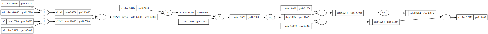

# Custom MLP with Manual Backpropagation

This repository implements a simple **Multilayer Perceptron (MLP)** from scratch using pure Python. The primary focus of this project is to give a hands-on understanding of **backpropagation**, the fundamental algorithm behind training neural networks. Instead of relying on a machine learning framework like PyTorch or TensorFlow, this code manually computes gradients and updates weights using chain rule differentiation.

## Overview

The code provides a minimal neural network that computes forward passes through neurons and layers, then backpropagates gradients manually to update the model's weights. This is an excellent learning tool for those who want to get into the details of how deep learning works under the hood.

### Key Components

1. **Value Class (Core Computational Unit)**:
   - Each value represents a scalar quantity (like a neuron activation or a weight in the network) and tracks both its data and gradient.
   - It supports common operations like addition, multiplication, division, exponentiation, and activation functions (like `tanh`).
   - It also supports **manual backpropagation**, by keeping track of which operations created it and by computing gradients during the backward pass using the chain rule.

2. **Neuron Class**:
   - Implements a basic neuron, which computes a weighted sum of its inputs followed by a non-linear activation (in this case, the `tanh` function).
   - Each neuron has its own set of weights and a bias, all of which are represented as `Value` objects.

3. **Layer Class**:
   - A layer consists of multiple neurons, each receiving the same input and producing an independent output. 
   - The layer's job is to pass the input to each neuron, and combine the results.

4. **MLP Class**:
   - A multilayer perceptron (MLP) is built from multiple layers.
   - This class defines the architecture of the network, accepts an input, and passes it through each layer successively.

5. **Manual Backpropagation**:
   - After performing the forward pass (predicting an output), the code computes the **loss** (difference between the prediction and the actual target).
   - Backpropagation then computes gradients by applying the chain rule, starting from the loss and flowing back through the network.
   - Finally, the weights are updated based on these gradients.

## How It Works

### 1. Forward Pass
During the forward pass, the input is passed through each layer of the network, and each neuron computes the weighted sum of the input, adds a bias, and applies a non-linear activation function (`tanh` in this case).

### 2. Backpropagation
Backpropagation is performed manually by calculating the derivative of the loss with respect to each parameter (weights and biases). This is done using the **chain rule**, which allows us to propagate gradients backwards from the output through the layers of the network.

### 3. Gradient Descent
Once the gradients are computed via backpropagation, they are used to update the weights and biases of the network. This is done using **gradient descent**, which adjusts the parameters in the direction that reduces the loss. If the gradient is negative, then the weight or bias will be increased in the opposite direction to reduce the loss.

### Training Example
The training loop uses four input-output pairs. In each iteration:
- The model predicts an output for each input.
- The loss is computed as the squared difference between the predictions and the actual outputs.
- Backpropagation computes the gradients of the loss with respect to all parameters.
- The parameters (weights and biases) are updated using the gradients.

### Visualization of the Computation Graph
The code also includes a utility that visualizes the computation graph of the network using `graphviz`. The graph shows how each value in the forward pass depends on previous values, which can be helpful for understanding the flow of data and gradients through the network.


## Code Walkthrough

### Core Classes

- **`Value`**: Implements the basic scalar unit for computations. It supports operations like addition, multiplication, and exponentiation while keeping track of the operations to enable backpropagation.
  
- **`Neuron`**: Implements a single neuron, which takes an input, applies weights and biases, and passes it through the `tanh` activation function.
  
- **`Layer`**: Represents a collection of neurons, each receiving the same input and producing independent outputs.
  
- **`MLP`**: A multilayer perceptron made up of multiple layers.

### Example Forward and Backward Pass
Here is an example of a single neuron calculation, including the forward and backward pass:

```python
# inputs x1,x2
x1 = Value(2.0, label='x1')
x2 = Value(0.0, label='x2')
# weights w1,w2
w1 = Value(-3.0, label='w1')
w2 = Value(1.0, label='w2')
# bias of the neuron
b = Value(6.88, label='b')

# Forward pass: x1*w1 + x2*w2 + b
n = x1 * w1 + x2 * w2 + b

# Apply tanh activation
o = n.tanh()
o.label = 'output'

# Backward pass (computes gradients)
o.backward()
```
